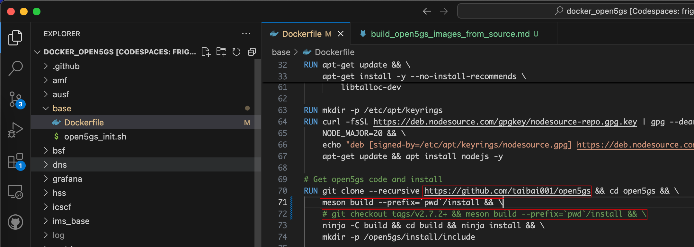

# 通过open5gs源代码构建open5gs docker镜像

## 准备
### 1. 分别fork open5gs、docker_open5gs项目

open5gs:
> https://github.com/taibai001/open5gs.git

docker_open5gs:
> https://github.com/taibai001/docker_open5gs.git

### 2. 配置docker_open5gs/base/Dockerfile
目标：在open5gs源码更新后，docker_open5gs编译拉取最新代码并编译到images

- 更换open5gs repo
- 取消切换至指定tag



## 从源构建docker_open5gs镜像
```bash
git clone https://github.com/taibai001/docker_open5gs

cd docker_open5gs/base

docker build --no-cache --force-rm -t docker_open5gs .
```

## 启动mme、sgwc网元
```bash
docker compose -f 4g-volte-deploy.yaml up mme sgwc
```